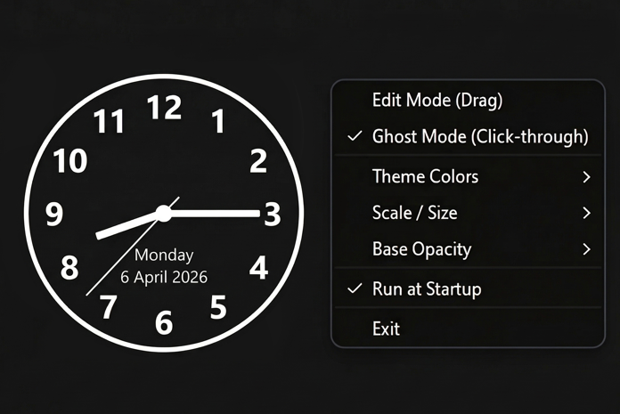

# analog-clock-overlay-for-windows

a simple software to create a clock overlay without interfering with the screen. It includes settings for position, size, color, transparency, and opacity. The settings appear only in the system tray, not on the taskbar.
